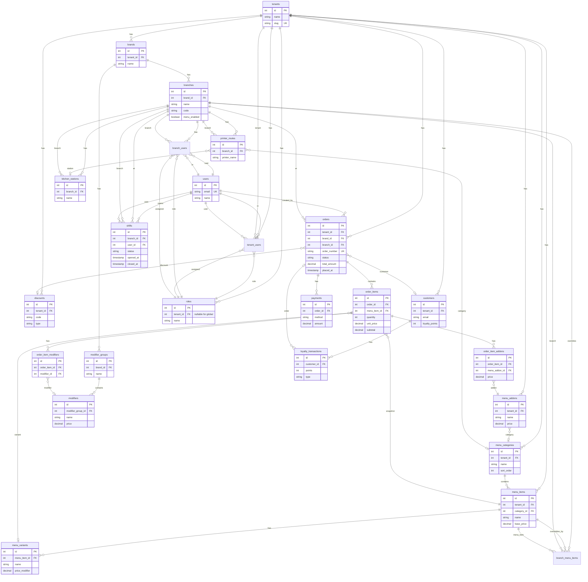

# Rough Foodie – Database ERD (High Level)

High-level entity-relationship diagram of the current database schema.

## Entity Relationship Diagram



## Logical groupings

| Group | Entities | Description |
|-------|----------|-------------|
| **Tenancy** | `tenants`, `users`, `roles`, `tenant_users`, `permissions` | Multi-tenant org and user access |
| **Brand & branch** | `brands`, `branches`, `branch_users`, `branch_menu_items` | Brands under tenant; branches under brand; branch-level menu overrides |
| **Menu** | `menu_categories`, `menu_items`, `menu_variants`, `menu_addons` | Tenant-scoped catalog |
| **Modifiers** | `modifier_groups`, `modifiers` | Brand-scoped modifier groups and options |
| **Orders** | `orders`, `order_items`, `order_item_addons`, `order_item_modifiers`, `payments` | POS orders and line items |
| **Operations** | `shifts`, `kitchen_stations`, `printer_routes` | Branch operations and KDS/printing |
| **Loyalty** | `customers`, `loyalty_transactions` | Customer and points (optional) |
| **Promotions** | `discounts` | Tenant-scoped discounts applied to orders |

## Key relationships

- **Tenant** is the top-level scope: owns brands, menu (categories/items/addons), discounts, customers, and roles.
- **Brand** belongs to one tenant; **Branch** belongs to one brand. Orders are placed at a branch.
- **Menu** is defined at tenant level; **branch_menu_items** can override price/availability per branch.
- **Order** is tied to tenant, brand, branch, and optionally customer and discount. **Order items** reference menu items/variants and can have addons and modifiers.
- **Shifts** are per branch and per user (one open shift per branch).
- **Printer routes** link a branch to a printer, optionally by menu category and/or kitchen station.

## PDF export

A pre-generated PDF is included: **[DATABASE_ERD.pdf](./DATABASE_ERD.pdf)**.

To regenerate it (requires Node and Puppeteer):

```bash
npx @mermaid-js/mermaid-cli -i docs/database-erd.mmd -o docs/DATABASE_ERD.pdf -e pdf -f
```

Other options:

- **Mermaid Live:** Copy the `erDiagram` block from this file into [mermaid.live](https://mermaid.live) and use **Actions → Export as PDF**.
- **VS Code:** Use a Mermaid/Markdown preview extension and print to PDF from the preview.
