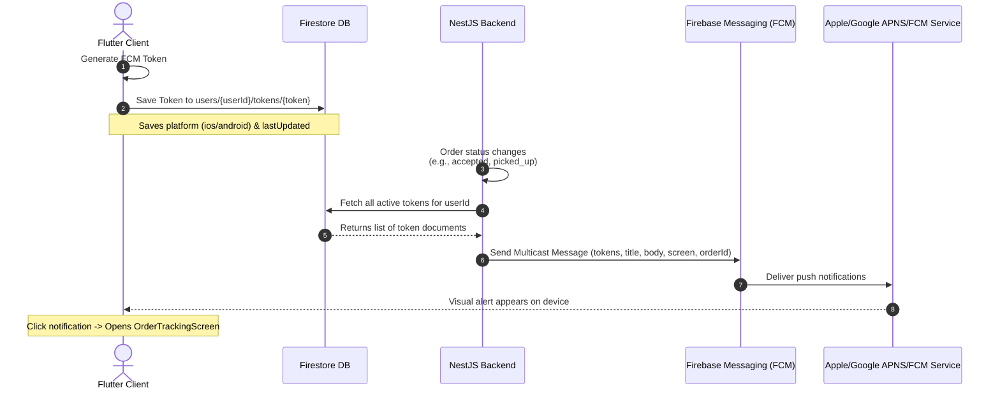

# Push Notifications: Integration & Backend Implementation Guide

This document maps the push notification architecture for the **Foodies** application. The client-side mobile implementation is **100% complete** and wired. The backend (NestJS) will integrate with it by querying FCM tokens from Cloud Firestore and sending multicast payloads.

---

## 📱 1. Completed Mobile-Side Architecture (Flutter)

The following components are already implemented and active in your Flutter client codebase:

### 🔑 1.1 App Initialization
* **File:** [main.dart](file:///Users/macbook/StudioProjects/Foodies/lib/main.dart#L21)
* **Status:** **Completed**
* **Details:** Registers and boots the [NotificationService](file:///Users/macbook/StudioProjects/Foodies/lib/services/notification_service.dart) as a global GetX dependency during app startup (`await Get.putAsync(() => NotificationService().init());`).

### 💾 1.2 FCM Token Registration
* **File:** [login_controller.dart](file:///Users/macbook/StudioProjects/Foodies/lib/controller/login_controller.dart#L116)
* **Status:** **Completed**
* **Details:** Upon successful login, the app requests the unique FCM registration token and calls `NotificationService.instance.saveTokenToFirestore(userId)`. 
* **Firestore Schema:**
  ```
  users/{userId}/tokens/{token}
  ├── token: string
  ├── platform: 'android' | 'ios'
  └── lastUpdated: FieldValue.serverTimestamp()
  ```

### ⚡ 1.3 Foreground & Background Listeners
* **File:** [NotificationService._configureMessaging](file:///Users/macbook/StudioProjects/Foodies/lib/services/notification_service.dart#L74)
* **Status:** **Completed**
* **Details:** 
  * **Foreground:** Listens to incoming FCM streams, translates them into high-priority local banners via `FlutterLocalNotificationsPlugin`, utilizing a channel labeled `'foodies_notifications'`.
  * **Background & Terminated:** Listens for visual banner clicks and routes user payloads to the click handler.

### 🧭 1.4 Deep Linking & Dynamic Routing
* **File:** [NotificationService._handleNotificationClick](file:///Users/macbook/StudioProjects/Foodies/lib/services/notification_service.dart#L146)
* **Status:** **Completed**
* **Details:** Parses incoming JSON data payloads. If `screen` matches `'order_tracking'`, it extracts `orderId`, converts it to an integer, and routes the user directly to the live [OrderTrackingScreen](file:///Users/macbook/StudioProjects/Foodies/lib/view/screens/order_tracking_screen.dart).

---

## 🔔 2. End-to-End Notification Flow



---

## 🛠️ 3. NestJS Backend Code Implementation

To match the mobile app, you must implement the following NestJS services:

### Step 3.1: Install Dependencies
```bash
npm install firebase-admin
npm install -D @types/node
```

### Step 3.2: Create the Global Firebase Module
#### 📄 `src/firebase/firebase.service.ts`
```typescript
import { Injectable, OnModuleInit, Logger } from '@nestjs/common';
import * as admin from 'firebase-admin';

@Injectable()
export class FirebaseService implements OnModuleInit {
  private readonly logger = new Logger(FirebaseService.name);
  private firebaseApp: admin.app.App;

  onModuleInit() {
    if (admin.apps.length > 0) {
      this.firebaseApp = admin.apps[0];
      return;
    }

    try {
      const serviceAccount = {
        projectId: process.env.FIREBASE_PROJECT_ID,
        clientEmail: process.env.FIREBASE_CLIENT_EMAIL,
        privateKey: process.env.FIREBASE_PRIVATE_KEY?.replace(/\\n/g, '\n'),
      };

      this.firebaseApp = admin.initializeApp({
        credential: admin.credential.cert(serviceAccount),
      });

      this.logger.log('🔥 Firebase Admin SDK initialized successfully.');
    } catch (error) {
      this.logger.error('❌ Failed to initialize Firebase Admin SDK', error.stack);
    }
  }

  get messaging(): admin.messaging.Messaging {
    return admin.messaging(this.firebaseApp);
  }

  get firestore(): admin.firestore.Firestore {
    return admin.firestore(this.firebaseApp);
  }
}
```

#### 📄 `src/firebase/firebase.module.ts`
```typescript
import { Module, Global } from '@nestjs/common';
import { FirebaseService } from './firebase.service';

@Global()
@Module({
  providers: [FirebaseService],
  exports: [FirebaseService],
})
export class FirebaseModule {}
```

---

### Step 3.3: Fetching Device Tokens from Firestore
Create a `NotificationService` that targets the subcollections where Flutter uploads the FCM registration tokens:

#### 📄 `src/notification/notification.service.ts`
```typescript
import { Injectable, Logger } from '@nestjs/common';
import { FirebaseService } from '../firebase/firebase.service';

@Injectable()
export class NotificationService {
  private readonly logger = new Logger(NotificationService.name);

  constructor(private readonly firebase: FirebaseService) {}

  /**
   * Reads tokens from Firestore users/{userId}/tokens subcollection
   */
  async getUserTokens(userId: string): Promise<string[]> {
    try {
      const tokensRef = this.firebase.firestore
        .collection('users')
        .doc(userId)
        .collection('tokens');

      const snapshot = await tokensRef.get();
      if (snapshot.empty) {
        this.logger.warn(`No notification tokens found for user: ${userId}`);
        return [];
      }

      return snapshot.docs.map(doc => doc.id); // Firestore Doc IDs are the FCM tokens
    } catch (error) {
      this.logger.error(`Error fetching tokens for user ${userId}`, error.stack);
      return [];
    }
  }
}
```

---

### Step 3.4: Send Target-Specific Notifications
Build the payload configured with matching **Deep Linking Keys** and the **Android Channel ID**:

#### 📄 `src/notification/notification.service.ts` (Continued)
```typescript
  /**
   * Sends order status updates to all registered devices of a user
   */
  async sendOrderStatusUpdate(
    userId: string,
    orderId: number,
    status: 'accepted' | 'picked_up' | 'delivered' | 'cancelled',
  ): Promise<void> {
    const tokens = await this.getUserTokens(userId);
    if (tokens.length === 0) return;

    const statusMessages = {
      accepted: {
        title: 'Chef is on it! 🍳',
        body: `Your order #${orderId} has been accepted and is being prepared.`,
      },
      picked_up: {
        title: 'Rider is on the way! 🛵',
        body: `Your hot food from Foodies is picked up and headed to you!`,
      },
      delivered: {
        title: 'Delivered! Bon Appétit 🎉',
        body: `Enjoy your delicious meal! Don't forget to rate your rider.`,
      },
      cancelled: {
        title: 'Order Status Update ⚠️',
        body: `Your order #${orderId} was cancelled. Check details or contact support.`,
      },
    };

    const msgConfig = statusMessages[status];
    if (!msgConfig) {
      this.logger.warn(`Unknown order status encountered: ${status}`);
      return;
    }

    // Build standard FCM Payload matching the Flutter Client expectations
    const messagePayload: admin.messaging.MulticastMessage = {
      tokens: tokens,
      notification: {
        title: msgConfig.title,
        body: msgConfig.body,
      },
      // Essential dynamic payload so client automatically redirects to the live map tracking
      data: {
        screen: 'order_tracking',
        orderId: orderId.toString(), 
      },
      // High-priority configurations to ensure prompt foreground/background delivery
      android: {
        priority: 'high',
        notification: {
          channelId: 'foodies_notifications', // Matches the channelId in your Flutter NotificationService
          sound: 'default',
        },
      },
      apns: {
        payload: {
          aps: {
            alert: {
              title: msgConfig.title,
              body: msgConfig.body,
            },
            sound: 'default',
            badge: 1,
          },
        },
      },
    };

    try {
      const response = await this.firebase.messaging.sendEachForMulticast(messagePayload);
      this.logger.log(`FCM Multicast response: ${response.successCount} succeeded, ${response.failureCount} failed.`);

      // Step 3.5: Clean up stale tokens returned by FCM (uninstalled apps/revoked permission)
      if (response.failureCount > 0) {
        const tokensToRemove: string[] = [];
        response.responses.forEach((res, index) => {
          if (!res.success && res.error) {
            const errorCode = res.error.code;
            const token = tokens[index];

            if (
              errorCode === 'messaging/registration-token-not-registered' ||
              errorCode === 'messaging/invalid-registration-token'
            ) {
              this.logger.warn(`Stale token identified: ${token}. Queueing for deletion.`);
              tokensToRemove.push(token);
            }
          }
        });

        if (tokensToRemove.length > 0) {
          await this.removeStaleTokens(userId, tokensToRemove);
        }
      }
    } catch (error) {
      this.logger.error(`Failed to dispatch FCM messages to user ${userId}`, error.stack);
    }
  }

  /**
   * Deletes stale/invalid registration tokens from Firestore
   */
  private async removeStaleTokens(userId: string, tokens: string[]): Promise<void> {
    const batch = this.firebase.firestore.batch();
    
    tokens.forEach(token => {
      const tokenRef = this.firebase.firestore
        .collection('users')
        .doc(userId)
        .collection('tokens')
        .doc(token);
      batch.delete(tokenRef);
    });

    await batch.commit();
    this.logger.log(`🧹 Cleaned up ${tokens.length} inactive tokens from users/${userId}/tokens`);
  }
```

---

## ⚡ 4. Integration Trigger Points

Inject `NotificationService` in your business logic and trigger notifications as orders shift state:

```typescript
@Injectable()
export class OrderService {
  constructor(
    private readonly orderRepo: OrderRepository,
    private readonly notificationService: NotificationService,
  ) {}

  async updateOrderStatus(orderId: number, status: OrderStatus): Promise<Order> {
    const updatedOrder = await this.orderRepo.update(orderId, { status });

    if (status === OrderStatus.ACCEPTED) {
      await this.notificationService.sendOrderStatusUpdate(updatedOrder.userId, orderId, 'accepted');
    } else if (status === OrderStatus.PICKED_UP) {
      await this.notificationService.sendOrderStatusUpdate(updatedOrder.userId, orderId, 'picked_up');
    } else if (status === OrderStatus.DELIVERED) {
      await this.notificationService.sendOrderStatusUpdate(updatedOrder.userId, orderId, 'delivered');
    } else if (status === OrderStatus.CANCELLED) {
      await this.notificationService.sendOrderStatusUpdate(updatedOrder.userId, orderId, 'cancelled');
    }

    return updatedOrder;
  }
}
```

---

## 🔒 5. Essential Firebase Console Configurations

Ensure you perform these checks inside the Firebase Console:

1. **Obtain Service Account credentials**:
   - Navigate to the **Firebase Console** -> Project Settings -> **Service Accounts**.
   - Select **Generate New Private Key** to download the credentials `.json` file.
   - Inject these variables (`FIREBASE_PROJECT_ID`, `FIREBASE_CLIENT_EMAIL`, and `FIREBASE_PRIVATE_KEY`) into your NestJS secure environment variables (`.env`).
2. **Enable APNs Certificates (For iOS Devices)**:
   - Navigate to Project Settings -> **Cloud Messaging** -> Apple app configuration.
   - Upload your Apple Push Notification service (APNs) key (obtained from Apple Developer Account) so Firebase can translate FCM calls into APNs alerts when users are on iOS.
3. **Double-check channel matching**:
   - The Flutter client registers an custom channel with ID `"foodies_notifications"`.
   - Your backend payload sets the `android.notification.channelId: 'foodies_notifications'` property to guarantee proper banner override and native notification sounds.
